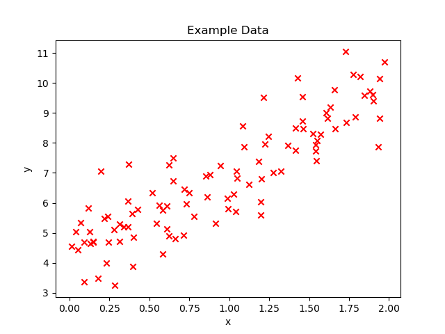
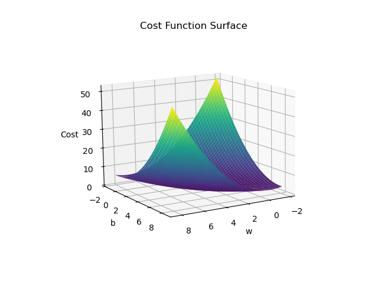
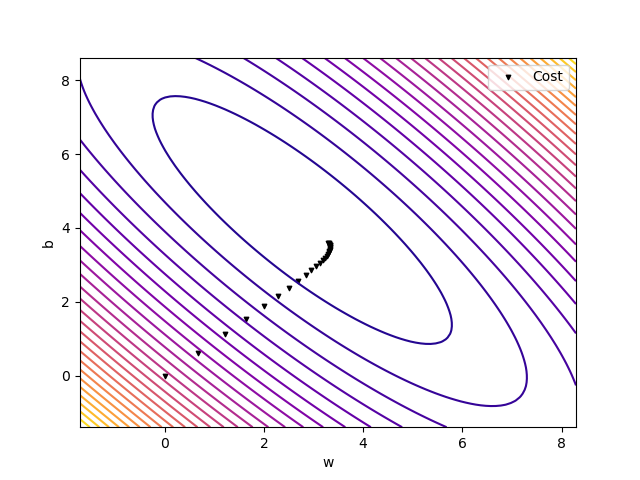
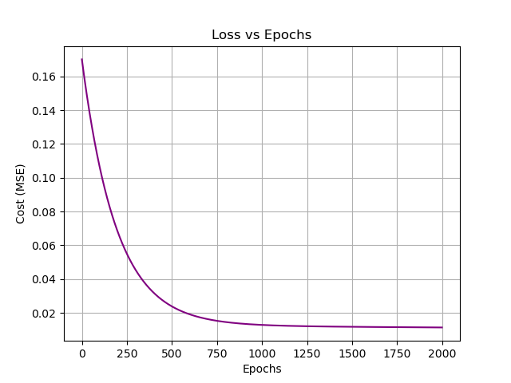

## ✨ Features
- **From Scratch:** No scikit-learn, only NumPy for math + Matplotlib for plotting
- **Simple Linear Regression:** One feature, regression line updates during training
- **Multiple Linear Regression:** Generalized to n features, trained with gradient descent
- **Visualizations:**
  - Data with regression line
  - Regression line evolution (animation)
  - Cost function surface (3D) & contours
  - Gradient Descent path on cost landscape

---

## 1. 💾 Dataset
- **Synthetic dataset** created for testing and experimentation
- 

---

## 2. 📉 Simple Linear Regression
Regression line plotted using the final values of \( w \) and \( b \) from gradient descent.  


---

## 3. 🎬 Regression Line Evolution (Animation)
Watch the regression line gradually fit the data:  


---

## 4. 🌄 Cost Function (3D Surface)
The cost function \( J(w, b) \) visualized in 3D for the 1-feature case:  



---

## 5. 🌀 Contour Plot of Cost Function
2D contour plot with gradient descent path:  



---

## 6. 🧮 Multiple Linear Regression
- Extended implementation to handle **multiple features**  
- Same gradient descent logic, generalized for n features
- Tracked the **error across epochs** to visualize convergence  

📉 Training error vs epochs:  


---

## 🚀 How to Run
Clone the repo and just run the notebook:

```bash
# Clone the repository
git clone https://github.com/aditya0x77/Linear-Regression-From-Scratch-With-Visualization.git
cd Linear-Regression-From-Scratch-With-Visualization

# Install dependencies
pip install numpy pandas matplotlib notebook

# Launch Jupyter Notebook
jupyter notebook

# Open the notebooks:
# Faster.ipynb              → Simple Linear Regression implementation with visualizations
# Multiple_Linear_Reg.ipynb → Multiple Linear Regression implementation with visualizations
```  

## 🌃 End of the Line, Choomba  

Thanks for checking out this little project.  
BYE! BYE!


